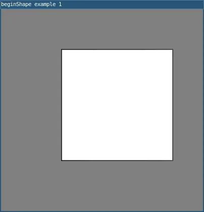
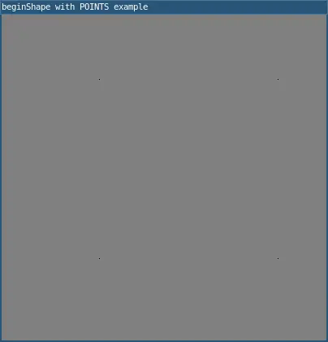

# beginShape()

Begins adding vertices to a custom shape.

The `beginShape()` and endShape() functions
allow for creating custom shapes in 2D or 3D. `beginShape()` begins adding vertices to a custom shape and endShape() stops adding them.

After calling `beginShape()`, shapes can be built by calling vertex(), alling endShape() will stop adding vertices to the shape. Each shape will be outlined with the current stroke color and filled with the current fill color.

Transformations such as translate(), rotate(), and scale() don't work between `beginShape()` and endShape(). It's also not possible to use other shapes, such as ellipse() or rect(), between `beginShape()` and endShape().

## Examples



```lua
require("L5")

function setup()
  size(400, 400)
  windowTitle("beginShape() example")
  
  beginShape()
  vertex(120,80)
  vertex(340, 80)
  vertex(340,300)
  vertex(120,300)
  endShape()

  describe("custom shape with beginShape() function, vertices and endShape()")
end
```

  

```lua
require("L5")

function setup()
  size(400, 400)
  windowTitle("beginShape() example")
  
  fill(0)
  beginShape()
  for i=0,10 do
    vertex(random(width),random(height))
  end
  endShape()
  describe("custom shape with beginShape() function, vertices and endShape()")
end
```

## Related

* [endShape()](endShape.md)


---

*This reference page contains content adapted from [p5.js](https://p5js.org/) and [Processing](https://processing.org) by [p5.js Contributors](https://github.com/processing/p5.js?tab=readme-ov-file#contributors) and [Processing Foundation](https://processingfoundation.org/people), licensed under [CC BY-NC-SA 4.0](https://creativecommons.org/licenses/by-nc-sa/4.0/).*
