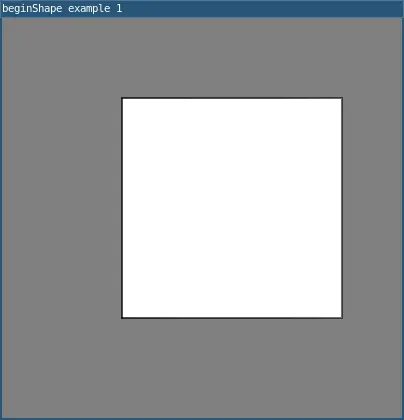
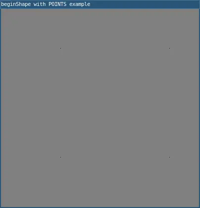
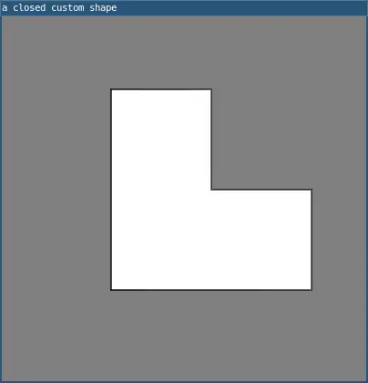
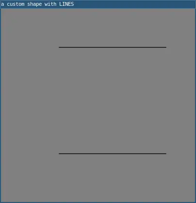
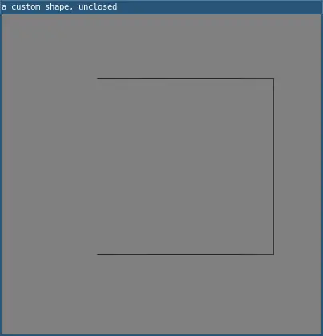
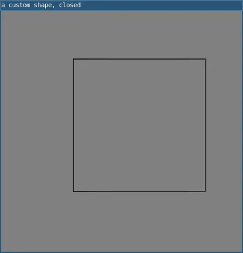
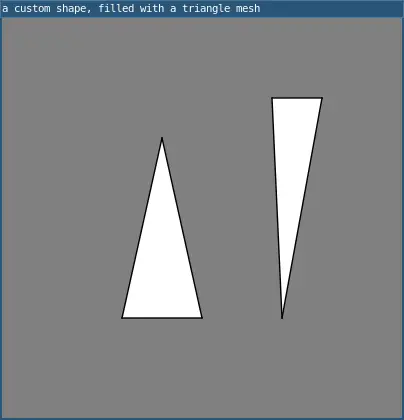
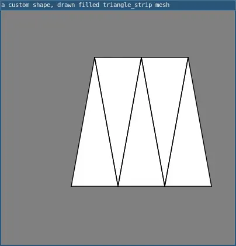
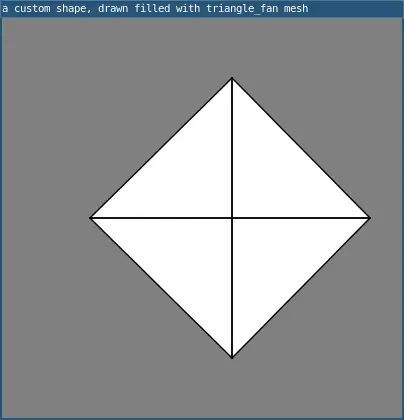
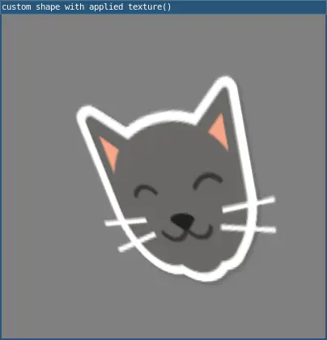

# beginShape()

Begins adding vertices to a custom shape.

The `beginShape()` and `endShape()` functions
allow for creating custom shapes in 2D. `beginShape()` begins adding vertices to a custom shape and endShape() stops adding them.

The value of the `kind` parameter tells it which types of shapes to create from the provided vertices. With no mode specified, the shape can be any irregular polygon. The parameters available for beginShape() are POINTS, LINES, TRIANGLES, TRIANGLE_FAN, TRIANGLE_STRIP.

After calling the `beginShape()`, a series of `vertex()` commands must follow. To stop drawing the shape, call `endShape()`. 

A texture can also be wrapped around a shape with an applied `texture()`.  The `texture()` function declares the texture to apply to the geometry and the `u` and `v` coordinates set define the mapping of this texture to the form. By default, the coordinates used for u and v are specified in relation to the image's size in pixels, but this relation can be changed with `textureMode()`.

## Examples



```lua

require("L5")

function setup()
  size(400, 400)
  windowTitle("beginShape example 1")

  beginShape()
  vertex(120, 80)
  vertex(340, 80)
  vertex(340, 300)
  vertex(120, 300)
  endShape(CLOSE)

  describe("A custom shape with beginShape, vertices and endShape, closed")
end
```

  

```lua
require("L5")

function setup()
  size(400,400)
  windowTitle("beginShape with POINTS example")

  beginShape(POINTS)
  vertex(120, 80)
  vertex(340, 80)
  vertex(340, 300)
  vertex(120, 300)
  endShape()

  describe("A custom shape made up of 4 points")
end
```

  

```lua
require("L5")

function setup()
  size(400,400)
  windowTitle("a closed custom shape")

  beginShape()
  vertex(120, 80)
  vertex(230, 80)
  vertex(230, 190)
  vertex(340, 190)
  vertex(340, 300)
  vertex(120, 300)
  endShape(CLOSE)

  describe("A custom shape made up of 4 points")
end
```

  

```lua
require("L5")

function setup()
  size(400,400)
  windowTitle("a custom shape with LINES")

  beginShape(LINES)
  vertex(120, 80)
  vertex(340, 80)
  vertex(340, 300)
  vertex(120, 300)
  endShape()

  describe("A custom shape built of 2 lines")
end
```

  

```lua
require("L5")

function setup()
  size(400,400)
  windowTitle("a custom shape, unclosed")

  noFill()
  beginShape()
  vertex(120, 80)
  vertex(340, 80)
  vertex(340, 300)
  vertex(120, 300)
  endShape()

  describe("A custom shape, unclosed")
end
```

  

```lua
require("L5")

function setup()
  size(400,400)
  windowTitle("a custom shape, closed")

  noFill()
  beginShape()
  vertex(120, 80)
  vertex(340, 80)
  vertex(340, 300)
  vertex(120, 300)
  endShape(CLOSE)

  describe("A custom shape, closed")
end
```

  

```lua
require("L5")

function setup()
  size(400,400)
  windowTitle("a custom shape, filled with a triangle mesh")

  beginShape(TRIANGLES)
  vertex(120, 300)
  vertex(160, 120)
  vertex(200, 300)
  vertex(270, 80)
  vertex(280, 300)
  vertex(320, 80)
  endShape()

  describe("A custom shape, filled with a triangle mesh")
end
```

  

```lua
require("L5")

function setup()
  size(400,400)
  windowTitle("a custom shape, drawn filled triangle_strip mesh")

  beginShape(TRIANGLE_STRIP)
  vertex(120, 300)
  vertex(160, 80)
  vertex(200, 300)
  vertex(240, 80)
  vertex(280, 300)
  vertex(320, 80)
  vertex(360, 300)
  endShape()

  describe("A custom shape, drawn filled with triangle_strip mesh")
end
```

  

```lua
require("L5")

function setup()
  size(400,400)
  windowTitle("a custom shape, drawn filled with triangle_fan mesh")

  beginShape(TRIANGLE_FAN)
  vertex(230, 200)
  vertex(230, 60) 
  vertex(368, 200) 
  vertex(230, 340) 
  vertex(88, 200) 
  vertex(230, 60) 
  endShape()

  describe("A custom shape, drawn filled with triangle_fan mesh")
end
```

  

```lua
require("L5")

function setup()
  size(400, 400)
  windowTitle("custom shape with applied texture()")
  textureMode(NORMAL)

  img = loadImage("assets/cat.png")

  noStroke()
  beginShape()
  texture(img)
  -- "cat.png" is 128x128 pixels in size
  -- normal mode values 0 and 1 are used for the
  -- parameters "u" and "v" to map it directly
  -- to the vertex points
  vertex(40, 80, 0, 0)
  vertex(320, 20, 1, 0)
  vertex(380, 360, 1, 1)
  vertex(160, 380, 0, 1)
  endShape()

  describe("Wrapping a mesh texture around a custom shape with coordinates specified with u,v in normal mode 0 to 1")
end
```

## Syntax

```lua
beginShape()
beginShape(kind)
```

## Parameters

| Parameter |                                                                        |
| -         | --                                                                     |
| kind      | string: either POINTS, LINES, TRIANGLES, TRIANGLE_FAN, TRIANGLE_STRIP. |


## Related

* [endShape()](endShape.md)
* [texture()](texture.md)
* [textureMode()](textureMode.md)
* [textureWrap()](textureWrap.md)
* [vertex()](vertex.md)

---

*This reference page contains content adapted from [p5.js](https://p5js.org/) and [Processing](https://processing.org) by [p5.js Contributors](https://github.com/processing/p5.js?tab=readme-ov-file#contributors) and [Processing Foundation](https://processingfoundation.org/people), licensed under [CC BY-NC-SA 4.0](https://creativecommons.org/licenses/by-nc-sa/4.0/).*
