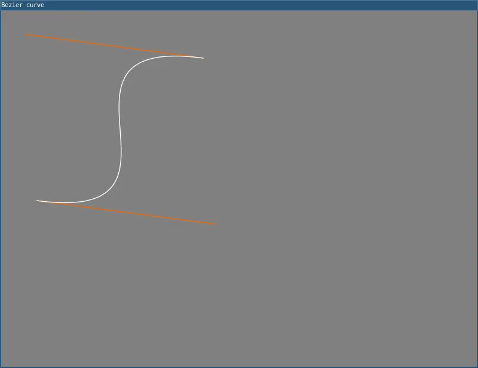

# bezier()

Draws a Bézier curve on the screen. These curves are defined by a series of anchor and control points. The first two parameters specify the first anchor point and the last two parameters specify the other anchor point. The middle parameters specify the control points which define the shape of the curve. The curves were developed by French engineer Pierre Bezier. 

## Examples



```lua
function setup() 
  noFill()
  stroke(255, 102, 0)
  line(340, 80, 40, 40)
  line(360, 360, 60, 320)
  stroke(0, 0, 0)
  bezier(340, 80, 40, 40, 360, 360, 60, 320)

  describe('A bezier curve with red lines extending away from either end')
end
```

## Syntax

```lua
bezier(x1, y1, x2, y2, x3, y3, x4, y4)
```

## Parameters

| Parameter |                                                          |
| -         | --------------------------------------------------       |
| x1        | Number: x-coordinate of the first anchor point.          |
| y1        | Number: y-coordinate of the first anchor point.          |
| x2        | Number: x-coordinate of the first control point.         |
| y2        | Number: y-coordinate of the first control point.         |
| x3        | Number: x-coordinate of the second control point.        |
| y3        | Number: y-coordinate of the second control point.        |
| x4        | Number: x-coordinate of the second anchor point.         |
| y4        | Number: y-coordinate of the second anchor point.         |

## Related

