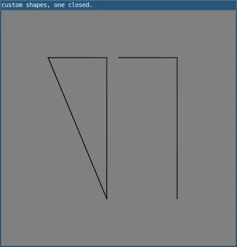

# endShape()

Begins adding vertices to a custom shape.

The beginShape() and `endShape()` functions
allow for creating custom shapes in 2D.  `beginShape()` begins adding vertices to a custom shape and `endShape()` stops adding them.


After calling beginShape(), shapes can be built by calling vertex(). Calling `endShape()` will stop adding vertices to the shape. Each shape will be outlined with the current stroke color and filled with the current fill color, or an applied texture.

Transformations such as translate(), rotate(), and scale() don't work between beginShape() and `endShape()`. It's also not possible to use other shapes, such as ellipse() or rect(), between beginShape() and `endShape()`.

## Examples



```lua

require("L5")

function setup()
  size(400, 400)
  noFill()
  windowTitle("custom shapes, one closed.")

  beginShape()
  vertex(80, 80)
  vertex(180, 80)
  vertex(180, 320)
  endShape(CLOSE)

  beginShape()
  vertex(200, 80)
  vertex(300, 80)
  vertex(300, 320)
  endShape()

  describe("Two custom shapes, one closed and one not closed.")
end
```

## Related

* [beginShape()](beginShape.md)
* [vertex()](vertex.md)

---

*This reference page contains content adapted from [p5.js](https://p5js.org/) and [Processing](https://processing.org) by [p5.js Contributors](https://github.com/processing/p5.js?tab=readme-ov-file#contributors) and [Processing Foundation](https://processingfoundation.org/people), licensed under [CC BY-NC-SA 4.0](https://creativecommons.org/licenses/by-nc-sa/4.0/).*
