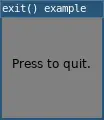

# exit()

Quits/stops/exits the program and closes the program window.

## Examples



```lua
require("L5")

function setup()
  size(100, 100)
  windowTitle('exit() example')

  fill(0)
  text("Press to quit.",10,height/2)

  describe('A window advising to click to quit.')
end

function mousePressed()
  exit()
end
```

## Related

* [draw()](draw.md)
* [noLoop()](noLoop.md)
* [mousePressed()](mousePressed.md)
* [keyPressed()](keyPressed.md)


---

*This reference page contains content adapted from [p5.js](https://p5js.org/) and [Processing](https://processing.org) by [p5.js Contributors](https://github.com/processing/p5.js?tab=readme-ov-file#contributors) and [Processing Foundation](https://processingfoundation.org/people), licensed under [CC BY-NC-SA 4.0](https://creativecommons.org/licenses/by-nc-sa/4.0/).*
