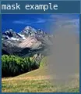

# mask()

Masks part of the image with another.

`mask()` uses another image's alpha channel as the alpha channel for this image. Masks are cumulative and can't be removed once applied. If the mask has a different pixel density from this image, the mask will be scaled.

## Examples



```lua
require 'L5'

function setup()
  size(100,100)
  windowTitle('mask example')

  -- Load the images
  photo = loadImage('assets/rockies.jpg')
  maskImage = loadImage('assets/mask2.png')
  
  -- Apply the mask
  mask(photo, maskImage)
  
  -- Display the image
  image(photo, 0, 0, width, height)
  
  describe('An image of a mountain landscape. The right side of the image has a faded patch of white.')
end
```

## Syntax

```lua
mask(targetImage, maskImage)
```

## Parameters

| Parameter   |                                                    |
| -           | -------------------------------------------------- |
| targetImage | image: texture that mask will be applied to.       |
| maskImage   | image: texture that will be applied as a mask.     |


## Related

* [blend()](blend.md)
* [copy()](copy.md)
* [filter()](filter.md)

---

*This reference page contains content adapted from [p5.js](https://p5js.org/) and [Processing](https://processing.org) by [p5.js Contributors](https://github.com/processing/p5.js?tab=readme-ov-file#contributors) and [Processing Foundation](https://processingfoundation.org/people), licensed under [CC BY-NC-SA 4.0](https://creativecommons.org/licenses/by-nc-sa/4.0/).*
