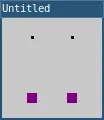

# point()

Draws a single point in space.

A point's default width is one pixel. To color a point, use the stroke() function. To change its width, use the strokeWeight() function. A point can't be filled, so the fill() function won't affect the point's color.

Set the point location with its x- and y-coordinates, as in point(10, 20).

## Example



```lua
function setup() 
  size(100, 100)

  background(200)

  -- Top-left.
  point(30, 20)

  -- Top-right.
  point(70, 20)

  -- Style the next points.
  stroke('purple')
  strokeWeight(10)

  -- Bottom-right.
  point(70, 80)

  -- Bottom-left.
  point(30, 80)

  describe('Four points drawn on a gray canvas. Two are black and two are purple. The points form the corners of a square.')
end
```

## Syntax

```lua
point(x, y)
```

## Parameters

| Parameter |                                                    |
| -         | -------------------------------------------------- |
| x        | Number: x-coordinate of the point.           |
| y        | Number: y-coordinate of the point.           |

## Related

* [stroke()](stroke.md)
