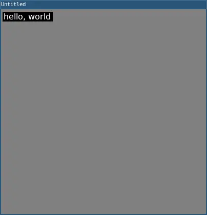

# printToScreen()
 
Displays `print()` text output in the running program window.

`printToScreen()` is a helper function to enable viewing `print()` output without requiring running L5 from the console or an IDE. This allows, for example, a program to be run simply by dragging its project folder onto the *Love application* file.

Each call to `print()` will produce a new line of text in the window. It is particularly useful for debugging.

By default the print size is 16 but a font size can optionally be specified as an argument to the function.

`printToScreen()` runs continuously overlaying on top of the drawn graphics. Calling `print()` within the `draw()` function will cause printed commands to scroll the text output continuously.

## Examples



```lua
require("L5")

function setup()
  size(100, 100)

  print('hello, world')
  
  printToScreen()

  describe("prints Hello, World to the screen and console.")
end
```


```lua
require("L5")

function setup()
  size(400, 400)

  printToScreen()

  describe("prints the frameCount, increasing and scrolling the text output.")
end

function draw()
  print(frameCount)
end
```

## Syntax

```lua
printToScreen()
```

```lua
printToScreen(fontsize)
```

## Parameters

| Parameter |                                           |
| -         | --                                        |
| fontsize  | Number: Optional, size of font specified. |


## Related

* [print()](print.md)
* [frameCount](frameCount.md)
* [describe()](describe.md)
* [text()](text.md)

---

