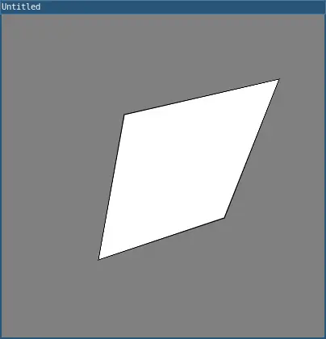

# quad()

A quad is a quadrilateral, a four sided polygon. It is similar to a rectangle, but the angles between its edges are not constrained to ninety degrees. The first pair of parameters (x1,y1) sets the first vertex and the subsequent pairs should proceed clockwise or counter-clockwise around the defined shape.

## Examples



```lua
function setup() 
  size(400, 400)
  quad(152, 124, 344, 80, 276, 252, 120, 304)
  
  describe('A white quadrilateral outlined in black.')
end
```

## Syntax

```lua
quad(x1, y1, x2, y2, x3, y3, x4, y4)
```

## Parameters

| Parameter |                                                    |
| -         | -------------------------------------------------- |
| x1        | Number: x-coordinate of the first corner.          |
| y1        | Number: y-coordinate of the first corner.          |
| x2        | Number: x-coordinate of the second corner.         |
| y2        | Number: y-coordinate of the second corner.         |
| x3        | Number: x-coordinate of the third corner.          |
| y3        | Number: y-coordinate of the third corner.          |
| x4        | Number: x-coordinate of the fourth corner.         |
| y4        | Number: y-coordinate of the fourth corner.         |

## Related

