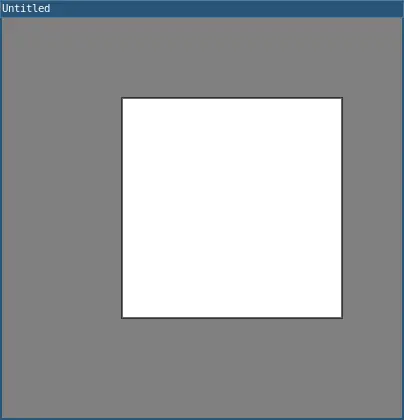
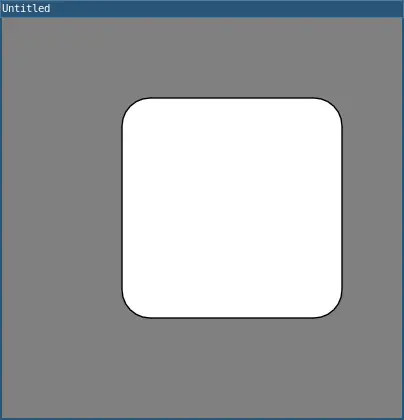

# rect()

Draws a rectangle to the screen. A rectangle is a four-sided shape with every angle at ninety degrees. By default, the first two parameters set the location of the upper-left corner, the third sets the width, and the fourth sets the height. The way these parameters are interpreted, however, may be changed with the rectMode() function.

To draw a rounded rectangle, add a fifth parameter, which is used as the radius value for all four corners.

## Examples



```lua
function setup() 
  size(400, 400)
  rect(120, 80, 220, 220)

  describe('A white rectangle.')
end
```



```lua
function setup()
  size(400, 400)
  rect(120, 80, 220, 220, 28)
  
  describe('A white rectangle with rounded edges')
end
```

## Syntax

```lua
rect(a, b, c, d)
rect(a, b, c, d, r)
```

## Parameters

| Parameter |                                                                  |
| -         | --------------------------------------------------               |
| a         | Number: x-coordinate of the rectangle by default.               |
| b         | Number: y-coordinate of the rectangle by default.               |
| c         | Number: width of the rectangle by default.                      |
| d         | Number: height of the rectangle by default.                     |
| r         | Number: radii of the corners.                                   |

## Related

* [rectMode](rectMode.md)
* [quad()](quad.md)
