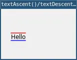

# textAscent()

Returns the ascent of the text.

The `textAscent()` function calculates the distance from the baseline to the highest point of the current font. This value represents the ascent, which is essential for determining the overall height of the text along with `textDescent()`. 

## Examples



```lua
require("L5")

function setup()
  size(150, 100)
  windowTitle("textAscent()/textDescent() example")

  background(240)
  fill(0)
  textAlign(LEFT, BASELINE)

  local baselineY = 60
  local msg = "Hello"
  text(msg, 20, baselineY)

  stroke(255, 0, 0)
  local topY = baselineY - textAscent()
  line(20, topY, 20 + textWidth(msg), topY)

  stroke(0, 0, 255)
  local bottomY = baselineY + textDescent()
  line(20, bottomY, 20 + textWidth(msg), bottomY)

  describe("The text Hello with a red line above and a blue line below.")
end

```

## Syntax

```lua
textAscent()
```

## Returns

Number: The ascent value in pixels.

## Related

* [textAlign()](textAlign.md)
* [textDescent()](textDescent.md)
* [textFont()](textFont.md)
* [textHeight()](textHeight.md)
* [textWidth()](textWidth.md)
* [textWrap()](textWrap.md)


---

*This reference page contains content adapted from [p5.js](https://p5js.org/) and [Processing](https://processing.org) by [p5.js Contributors](https://github.com/processing/p5.js?tab=readme-ov-file#contributors) and [Processing Foundation](https://processingfoundation.org/people), licensed under [CC BY-NC-SA 4.0](https://creativecommons.org/licenses/by-nc-sa/4.0/).*
