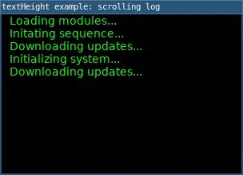

# textHeight()

Returns the height of a line of text drawn in the current font when text() is called. 

*Note: `textHeight()` includes the spacing between lines (called "leading") which may differ from a letter's height. Using `textAscent() + textDescent()` will more closely calculate letter height without spacing.*

## Examples



```lua
require("L5")

local logLines = {}
local timer = 0
local messages = {
  "Initializing system...",
  "Loading modules...",
  "Connecting to network...",
  "Calibrating sensors...",
  "Downloading updates...",
  "Initating sequence...",
}

function setup()
  size(300, 200)
  windowTitle('textHeight example: scrolling log')
  background(0)
  textSize(14)
  textAlign(LEFT, TOP)
  
  describe("A sequence of startup / loading instructions are printed, a new instruction added each second.")
end

function draw()
  background(0)
  fill(0, 255, 0)

  -- How many lines can actually fit on screen?
  local maxLines = floor(height / textHeight())

  -- Draw only the most recent lines that fit
  local startIndex = max(1, #logLines - maxLines + 1)
  for i = startIndex, #logLines do
    local row = i - startIndex
    text(logLines[i], 10, row * textHeight())
  end

  if millis() > timer then
    --insert random message at end
    table.insert(logLines, random(messages))
    timer = millis() + 1000
  end
end
```

## Syntax

```lua
textHeight()
```

## Returns

Number: height of a line of text in current font

## Related

* [textAscent()](textAscent.md)
* [textAlign()](textAlign.md)
* [textDescent()](textDescent.md)
* [textFont()](textFont.md)
* [textWidth()](textWidth.md)
* [textWrap()](textWrap.md)


---

