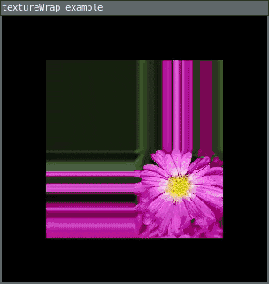

# textureWrap()

Defines if textures repeat or draw once within a texture map. The two parameters are CLAMP (the default behavior) and REPEAT. 

## Examples



```lua
local img

require("L5")

function setup()
  size(300, 300)
  img = loadImage("assets/flower.jpg")
  textureMode(NORMAL)
  windowTitle("textureWrap example")
  describe("The texture is applied and tiled or clamped to the custom shape")
end

function draw() 
  background(0)
  translate(width/2, height/2)
  rotate(map(mouseX, 0, width, -PI, PI))
  if mouseIsPressed then
    textureWrap(REPEAT)
  else 
    textureWrap(CLAMP)
  end

  beginShape()
  texture(img)
  vertex(-100, -100, 0, 0)
  vertex(100, -100, 2, 0)
  vertex(100, 100, 2, 2)
  vertex(-100, 100, 0, 2)
  endShape()
end
```

## Syntax

```lua
textureWrap(wrap)
```

## Parameters

wrap: Either CLAMP (default) or REPEAT.

## Related

* [beginShape()](beginShape.md)
* [endShape()](endShape.md)
* [texture()](texture.md)
* [textureMode()](textureMode.md)

---

*This reference page contains content adapted from [p5.js](https://p5js.org/) and [Processing](https://processing.org) by [p5.js Contributors](https://github.com/processing/p5.js?tab=readme-ov-file#contributors) and [Processing Foundation](https://processingfoundation.org/people), licensed under [CC BY-NC-SA 4.0](https://creativecommons.org/licenses/by-nc-sa/4.0/).*
