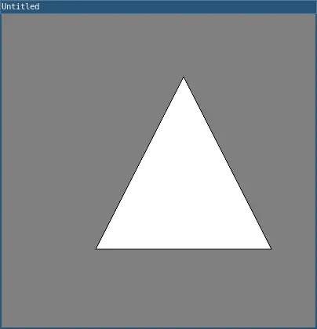

# triangle()

A triangle is a plane created by connecting three points. The first two arguments specify the first point, the middle two arguments specify the second point, and the last two arguments specify the third point.

## Examples



```lua
function setup() 
  size(400, 400)
  triangle(120, 300, 232, 80, 344, 300)
  
  describe('A white triangle outlined in gray.')
end
```

## Syntax

```lua
triangle(x1, y1, x2, y2, x3, y3)
```

## Parameters

| Parameter |                                                    |
| -         | -------------------------------------------------- |
| x1        | Number: x-coordinate of the first point.           |
| y1        | Number: y-coordinate of the first point.           |
| x2        | Number: x-coordinate of the second point.          |
| y2        | Number: y-coordinate of the second point.          |
| x3        | Number: x-coordinate of the third point.           |
| y3        | Number: y-coordinate of the third point.           |

## Related
